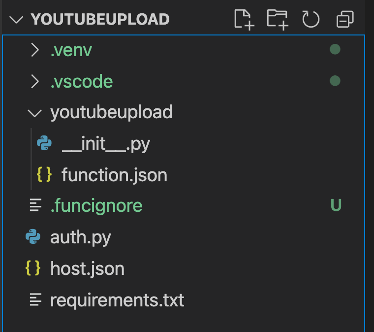
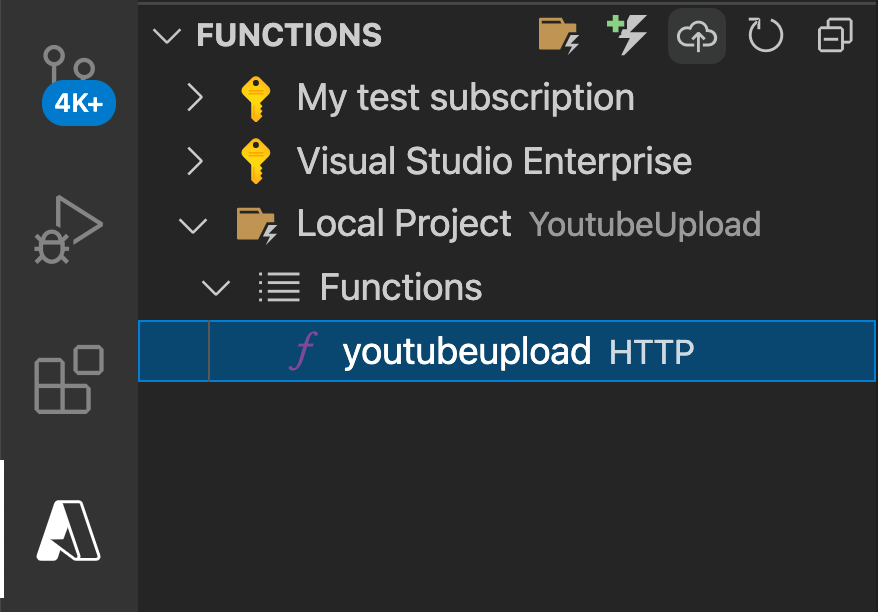
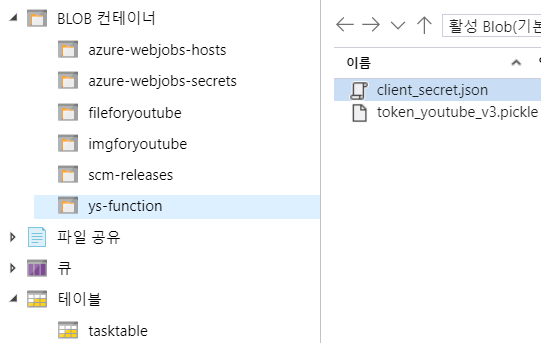
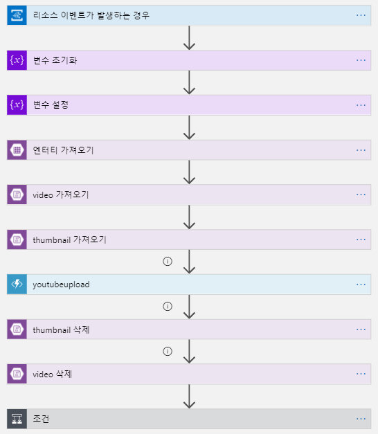
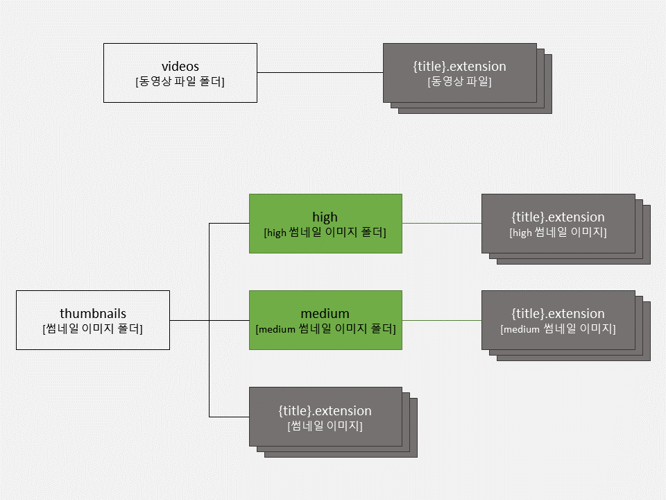
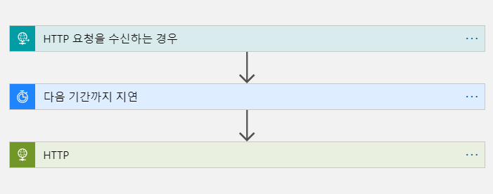

**데이터: Functions & Logic Apps 파트**
===

**Azure에 배포하기**
---

- Visual Studio Code를 `azure/YoutubeUpload` 폴더 기준으로 열기



- `Azure Functions` 확장을 설치한 후, 해당 확장으로 이동해 Local Project의 `youtubeupload` 확인



- 다음 단계를 따라가세요:  
`Deploy to Function App...` > `youtubeupload` > `Create new Function App in Azure...(Advanced)` > 고유한 이름 입력 > `Python 3.9` > `Create new resource group` > `YoutubeScheduler` > `한국 중부` > `Consumption` > `Create new storage account` > 고유한 이름 입력 > `Skip for now`

- Azure Portal로 이동해 `YoutubeScheduler` 리소스 그룹 > 생성한 스토리지 계정으로 이동

- 좌측 탭의 `액세스 키` 클릭 후 연결 문자열 복사

- 생성한 Function App으로 이동

- 좌측 탭의 `구성` 클릭 후 `새 애플리케이션 설정` > 이름: `AZURE_STORAGE_CONNECTION_STRING`, 값: 복사한 연결 문자열

- 스토리지 계정으로 돌아오기

- 스토리지 계정의 Blob에 `fileforyoutube`, `imgforyoutube`, `ys-function` 컨테이너 생성, Table에 `tasktable` 생성

- `ys-function` 컨테이너에 github의 `client_secret.json`, `token_youtube_v3.pickle` 파일 업로드



- github의 `azure/logicapp.json` 열기

- Azure Portal에서 `YoutubeScheduler` 리소스 그룹에 논리 앱 `YS-logic` 생성, 리소스로 이동

- `비어있는 논리 앱` > `코드 보기` > logicapp.json 내용 복사, 붙여넣기 > `디자이너`

- 트리거 단계 클릭 후 새 연결 만들기 > 로그인 > 리소스 이름 클릭 후 스토리지 계정 선택

- 느낌표 떠있는 단계 클릭 후 새 연결 만들기/기존 연결 선택(조건 내에도 있으니 주의)



- 추가) Logic App 실행 도중 youtubeupload 단계에서 막힌다면 다음 과정을 따라가세요.

  - 디자이너에서 youtubeupload 단계 삭제 후 새로 생성(azure function > 생성한 function app > youtubeupload)

  - 요청 본문에 아래 내용 삽입

  ```
  {
    "table": @{body('엔터티_가져오기')},
    "thumbnail": @{body('thumbnail_가져오기')?['Name']},
    "video": @{body('video_가져오기')?['Name']}
  }
  ```

  - Add new parameter > 메소드 > POST로 지정

  - youtubeupload의 ...을 눌러 `다음 시간 이후 실행 구성` > 모두 체크해 주세요

  - thumbnail 삭제의 ...을 눌러 `다음 시간 이후 실행 구성` > 모두 체크해 주세요

  - `조건`의 `값 선택` 부분이 비어있다면 클릭해 youtubeupload의 `상태코드`를 넣어주세요

**YouTube Data API에 사용되는  데이터**
---

``` json
{
  "snippet": {
    "title": string,
    "description": string,
    "thumbnails": {
      "default": {
        "url": string,
        "width": unsigned integer,
        "height": unsigned integer
      },
      "medium": {
        "url": string,
        "width": unsigned integer,
        "height": unsigned integer
      },
      "high": {
        "url": string,
        "width": unsigned integer,
        "height": unsigned integer
      }
    },
    "channelTitle": string,
    "tags": [
      string
    ],
    "categoryId": string
  }
}
```

**정형 데이터 | Table Storage**
---

- PartitionKey = "text_data"
- RowKey = randomkey
- title
- description
- video = file extension
- thubmnail = file extension
- time = YYYY-MM-DDTHH-MM-SS

**비정형 데이터 | Blob Storage**
---

- 동영상 파일
- 썸네일 이미지

**Blob Storage 구조**
---



**Logic App 구조**
---



**youtubeupload** 실행 시 가져온 **엔터티, video, thumbnail**을 **POST**로 넘깁니다.
