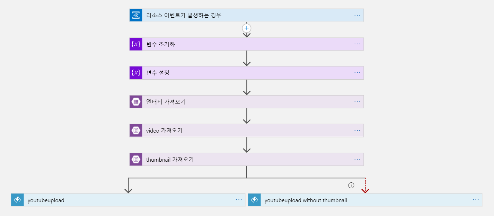

**데이터: Functions & Logic Apps 파트**
===

**Azure에 배포하기**
---
- Visual Studio Code를 `azure/YoutubeUpload` 폴더 기준으로 열기


- `Azure Functions` 확장을 설치한 후, 해당 확장으로 이동 후, `Local project` 에서 대상 함수 선택. 해당 함수를 클라우드에 배포


- ...


**YouTube Data API에 사용되는  데이터**
---

``` json
{
  "snippet": {
    "title": string,
    "description": string,
    "thumbnails": {
      "default": {
        "url": string,
        "width": unsigned integer,
        "height": unsigned integer
      },
      "medium": {
        "url": string,
        "width": unsigned integer,
        "height": unsigned integer
      },
      "high": {
        "url": string,
        "width": unsigned integer,
        "height": unsigned integer
      }
    },
    "channelTitle": string,
    "tags": [
      string
    ],
    "categoryId": string
  }
}
```

**정형 데이터 | Table Storage**
---

- PartitionKey = "text_data"
- RowKey = randomkey
- title
- description
- video = file extension
- thubmnail = file extension
- time = YYYY-MM-DDTHH-MM-SS

**비정형 데이터 | Blob Storage**
---

- 동영상 파일
- 썸네일 이미지

**Blob Storage 구조**
---


**Logic App 구조**
---



**youtubeupload** 실행 시 가져온 **엔터티, video, thumbnail**을 **POST**로 넘깁니다.
