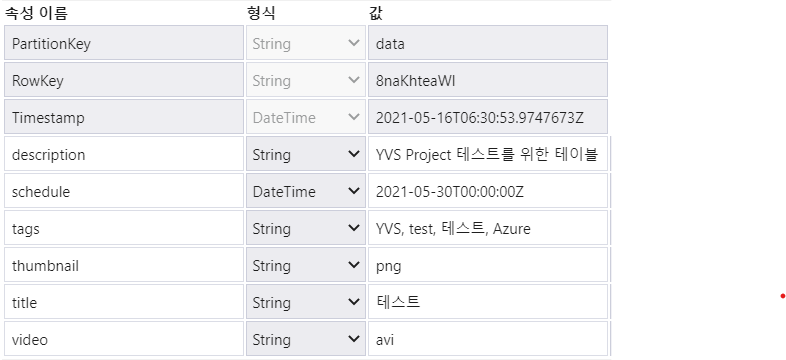

테스트 (Data Gathering)
===

used file & service
---

- azure functions
    - azure/DataGather/\_\_init__.py
    - azure/DataGather/function.json
- azure logic apps
    - azure/logicapps.json
- azure storage account(blob, table)

environment
---

Postman 이용  
table entity의 RowKey를 search_key로 사용  
blob storage에 "videos/1.avi"와 "thumbnails/thumbnail.png"가 업로드 돼있음  
  
table entity(위-old,  아래-new)
  

***

### Request URL [POST]

    https://prod-28.koreacentral.logic.azure.com:443/workflows/bd6d7f20e6b449168e2632e67f809b24/triggers/request/paths/invoke?api-version=2016-10-01&sp=%2Ftriggers%2Frequest%2Frun&sv=1.0&sig=cPB7WfwJVVjI3MF_-E8vbmEZ27bn3n4vjlfNqKPzLkg

### Request body

    {
        "UploadTime" : "2021-05-05T00:00:00Z",
        "RowKey" : "4aakjz1kag"
    }

### DataGather function까지 작동함을 확인. 2021-05-04