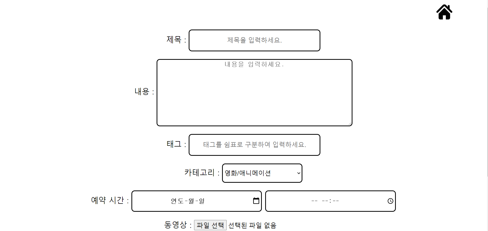

# frontend 

## azure-static-web-app 폴더
frontend 기본 화면
1. index.html -> 메인 화면 (추후 목록 추가 예정)
2. add.hml -> 업로드에 필요한 내용 등록 화면 (추후 azure blob,table 분리 예정)

## my-vanilla-api 폴더
azure static web app에서 azure functions api 사용 예제
