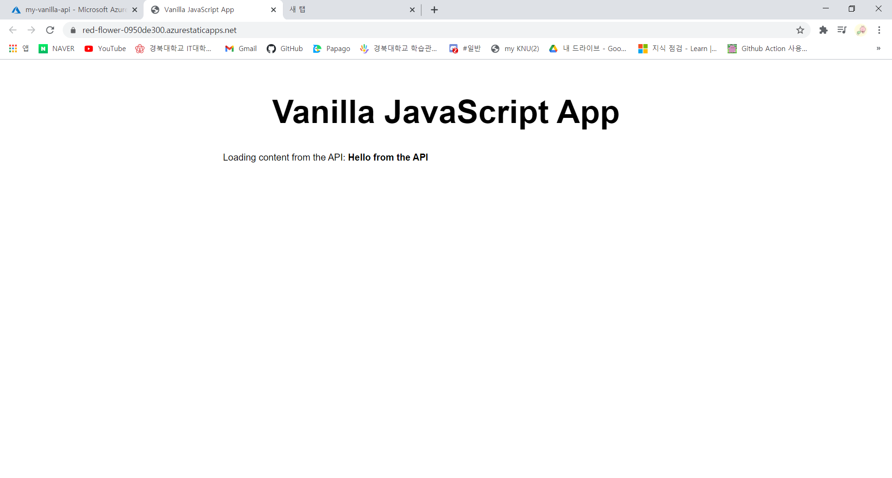

# Vanilla JavaScript App

[참고한 문서](https://docs.microsoft.com/ko-kr/azure/static-web-apps/add-api)

1. git repository를 생성한다. (이번 예제에서는 템플릿으로 자동 생성)
2. azure functions를 사용해서 api 만들기 (예제는 http 트리거로 api를 통해 웹 사이트로 텍스트를 전송한다.) 
3. github에 변경한 내용을 올리고 정적 웹앱을 만든다.

